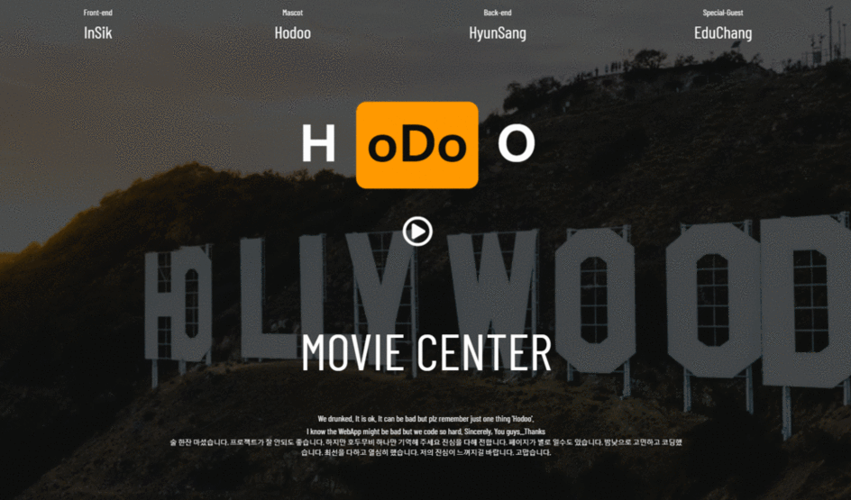
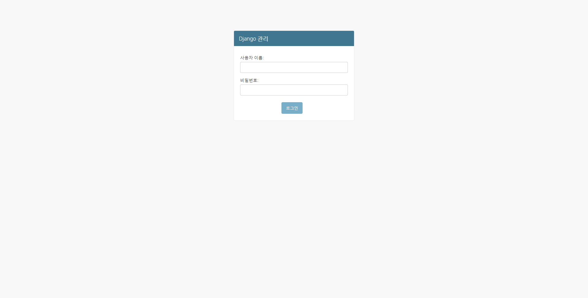
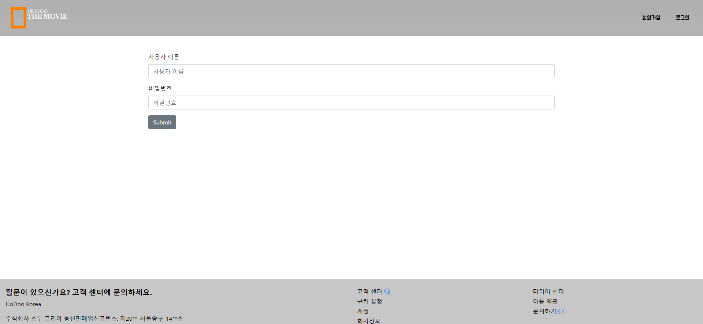
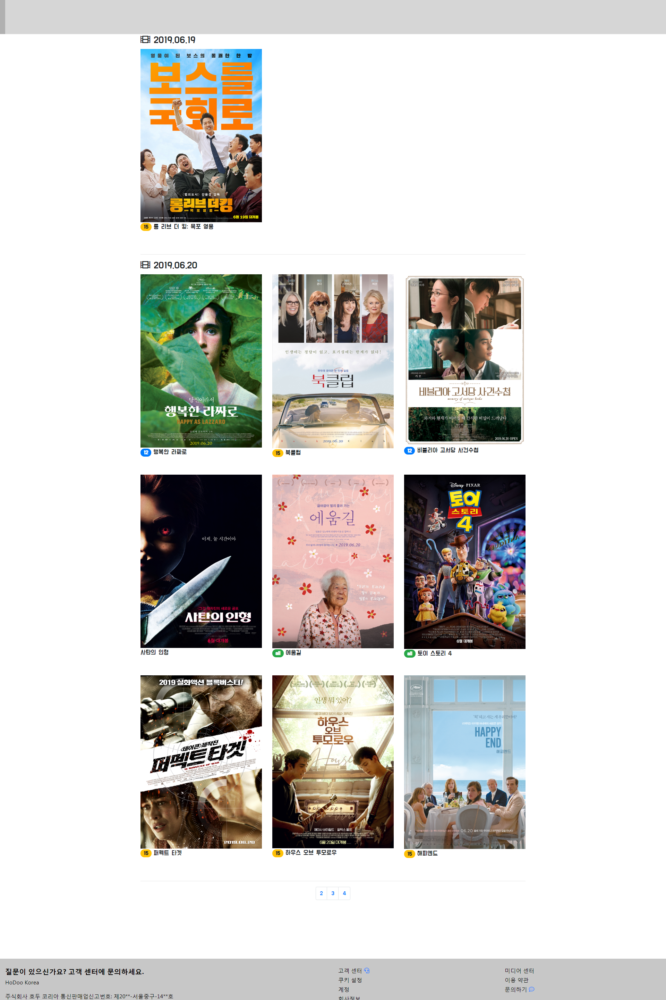
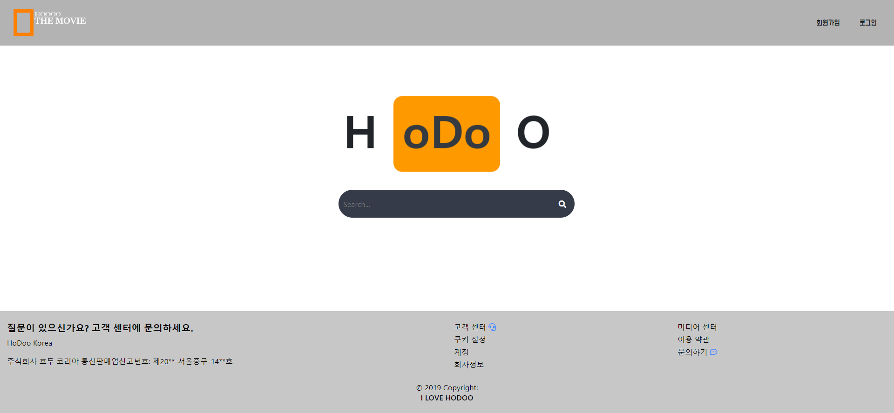
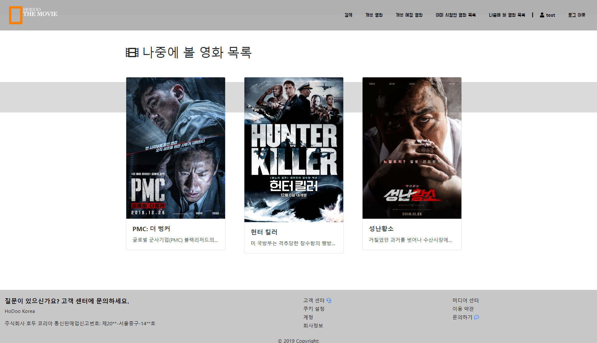
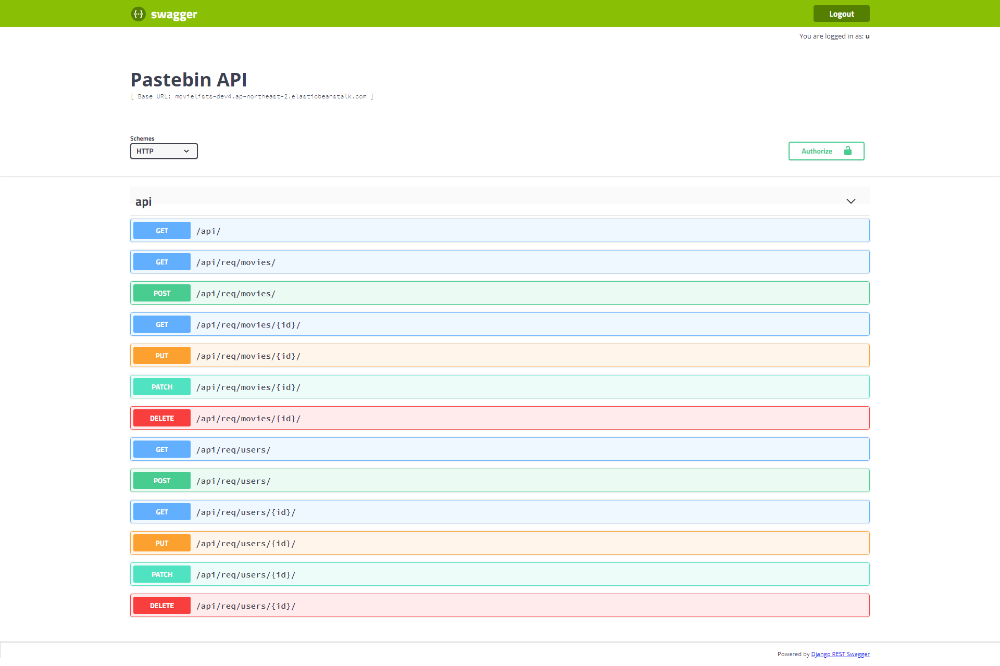
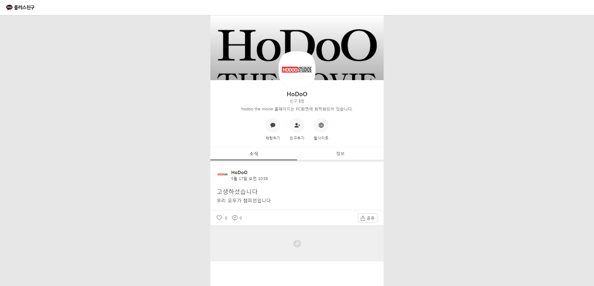

### 영화정보서비스(WATCHA)\_2인프로젝트\_황인식 외 1인

- 언어 : Python3
- 프레임워크 : Django
- 구현기능
  - 로그인, 영화 등록, 댓글
  - 최신 영화정보 크롤링, 게임(이스터에그)
- 담당 역할
  - Bootstrap 기본 UI 세팅, 크롤링, 게임 (외부 라이브러리 적용)
  - 백엔드, 모델 구성, API활용 DB 세팅&관리, RESTful API


#### Live Demo : [클릭](http://movielists-dev4.ap-northeast-2.elasticbeanstalk.com/)

URL http://movielists-dev4.ap-northeast-2.elasticbeanstalk.com/  

```html
테스트 계정   /    PW 
test        /   qqqq123!
```


---

### 프로젝트 목적

- Rest API, CRUD 구현, 학습내용 복기
- 오픈소스, API 활용 (레퍼런스 보는 연습)

#### 프로젝트 개요

- 영화 정보 조회 서비스 WATCHA 구현, 영화 평점과 댓글을 등록할 수 있고, 시청 영화, 보고 싶은 영화로 개인 영화 기호를 저장 관리 할 수 있습니다.

#### 프로젝트 발표 자료

#### **PPT :**  [클릭](https://docs.google.com/presentation/d/1qQ0z4cxDtFp-fiubJw3VYT-mG6mh5_AgcudOraOvoBA/edit?usp=sharing)

URL https://docs.google.com/presentation/d/1qQ0z4cxDtFp-fiubJw3VYT-mG6mh5_AgcudOraOvoBA/edit?usp=sharing

# 느낀점

- ##### 프로젝트의 의의와 목적 확실히 하기

  - ''그냥 배운거 써보면서 만들어보자''하고 시작을 해서 기본틀만 잡고 업무 분담도 대략적으로만 했더니 프로젝트 마감시간은 다가오는데 뭘 해야할지 뭘 만드는지에 대한 방향성이 없어 진행도 안되고 책임에 대한 경계도 없어서 일을 미루는 일이 발생해서 조율이 필요했습니다.
  - 자율적인 프로젝트 인 경우 팀 각 개인들의 프로젝트를 통해 얻고 싶은 목적을 참고해서 업무 분담을 하는 것도 필요하다는 것을 느꼈습니다.

**▶▶▶▶ ※ 분명한 방향과 목표 프로젝트 구성원끼리 공유하기**

---

- ##### 무분별한 오픈소스 활용 지앙 하기

  - 레퍼런스 활용 방법을 몰라서 발생하는 문제점 (ex 영어나 용어가 의미하는 정확한 뜻을 모른다.)
  - 가져다 활용은 했지만 내부 구성을 몰라서 발생하는 문제 (라이브러리 이름 비슷, 인코딩, 버전 문제 등)
  - 매개변수와 반환값 타입 등을 잘 알지 못해서 발생하는 문제들

**▶▶▶▶ ※ 비교적 유명한 오픈소스 활용하기(그래야 다른 참조 자료들이 많아서 문제 해결 가능성이 높다.)** 

---

- ##### 모델 구성 공부 좀 하자...

  - 처음엔 모델 구성을 좀 쉽게 생각했는데 관계 구성하는 부분들이 생각보다 복잡해서 효과적인 관계 설정을 고민, 지금은 정보처리기사의 정규화 내용과 매칭해 학습 중입니다.

**▶▶▶▶ ※ 코딩은 어떻게 구성해도 기능은 구현 되지만 deploy 했을 때 퍼포먼스가 좀 달라서 알고리즘을 학습해야 겠다는 생각이 들었습니다.** 

---

- ##### 내부 기능으로 테스트할 것이 아니라면 구현 기술과 기능이 중요한게 아니다.

  - 결과가 중요하다. 여기서 결과는
    - 프로젝트 기간에 맞춰 나오는 결과물
    - 프로젝트 내 목표로 했던 기능을 정해진 퍼포먼스로 기능하는가!
    - 보이는 면도 무시할 수 없다.
  - ~~(너무 슬프지만 내 욕심인가..ㅠ)~~아무리 기술이 좋아도 어려운 것을 해결 했어도 사람들의 충분한 공감과 니즈를 만족하지 못하면 빛나지 않는다.

**▶▶▶▶ ※ 개발이더라도 UI/UX에 대한 고민은 하자**

---

- ##### 계획을 할 때 최대한 구체적이면 좋다. (단계를 나누자!!)

  - 크롤링 기능을 구현할 때 느낀점
    - 목표 : 개봉 영화 정보를 긁어오자
    - 자동으로 모든 사이트들을 긁어오는 크롤러를 개발하고자 했지만 다음과 같은 문제들이 발생
      - 동적페이지 구성 사이트 정보를 가져오지 못한다.
      - 사이트별 태크 구성이 달라서 차이가 심하다
      - 동일한 정보를 여러번 가져온다.
    - 수정 목표 : 개봉 영화 정보가 있는 타겟 사이트를 찾자
      - 네이버 개봉 영화 정보를 찾아서 정보를 가져오고 재구성해 웹에 구성

**▶▶▶▶ ※ 지금 바로 달성 할 수 있는(최소한의 노력으로 목적을 달성할 수 있는) 단계부터 달성하고 기능을 업그레이드 하자** 

---

### 상세설명

```python
C9, bash 환경에서 개발하였습니다.
pyenv 1.2.9-2-g6309aaf2
Python 3.6.7
Django 2.1.8
```

※ 페이지는 1920*1080 화면 비율에 맞게 제작되었습니다.(이외 해상도 지원 X)

#### 실행 화면




##### Home(인트로페이지)

`path`   /


---

`@admin 유저만 접근 허용`

##### admin(관리자 페이지)

`path`   /admin




---

`@admin 유저만 접근 허용`

##### accounts(사용자 계정)

`path`   /accounts

현재 가입되어 있는 사용자 계정들을 보여줍니다.

실질적으로 관리자 페이지에서 계정 관리를 하기 때문에 뷰가 필요 없었습니다.

- **사용자 로그 인     :** /login



- 사용자 로그 아웃 : /logout

- 사용자 계정 생성 : /create

- 사용자 계정 수정 : /update
- 사용자 계정 삭제 : /\<int:id>/delete
- 사용자 상세 정보 : /detail


---

##### movies(영화 정보 페이지)

`path`   /movies

영화 

- **영화 정보 목록 :** /list


- **영화 디테일 :** /\<int:id>


- **개봉예정 영화 :** /preticket
  - 특정 사이트 개봉 예정 영화 정보 크롤링




`@로그인된 유저만 접근 허용`

- **영화 정보 검색 :** /search



- **보고 싶은 영화 목록 :** /like_post



- **이미 본 영화 목록 :** /watched_post


- 영화 댓글 추가 : /\<int:id>/scores/new
- 영화 댓글 삭제 : /\<int:id>/scores/\<int:score_new_id>/delete
- 영화 댓글 수정 : /\<int:id>/scores/\<int:score_id>/update
- 보고 싶은 영화 추가 : /\<int:id>/like
- 이미 본 영화 추가 : /\<int:id>/whatched


`@admin 유저만 접근 허용`

- 영화 정보 추가 :  /create
  - 영화 정보를 따로 추가할 수 있는 화면을 만들까 하다가 크롤링 업데이트로 변경
- 영화 정보 삭제:  /\<int:id>/delete
- 영화 정보 수정:  /\<int:id>/update
- API 영화 추가 : /put_data/\<int:year>
  - 영진위 api
  - The MovieDb api


---

##### game(이스터에그 게임)

`path`   /game

건물 쌓기 게임(오픈소스)_일부 구성 변경, 장고와 호환성 매칭

> 참조 URL 유실 찾는 즉시 업데이트 예정


---

##### api(RESTful API)

`path`   /api

RESTful API 제공

- 사용자 데이터
- 영화 데이터

`@일반적인 유저 접근`


`@admin 유저 접근`




##### Kakao 플러스 친구 연결




---

### 사용 외부 라이브러리

- 크롤링
  - beautifulsoup4
  - bs4
  - requests
  - urllib3
- Bootstrap4_django폼
  - django-bootstrap4
- REST API
  - django-rest-swagger
  - djangorestframework
- 더미 데이터
  - Faker
  - django-seed
- 배포
  - AWS